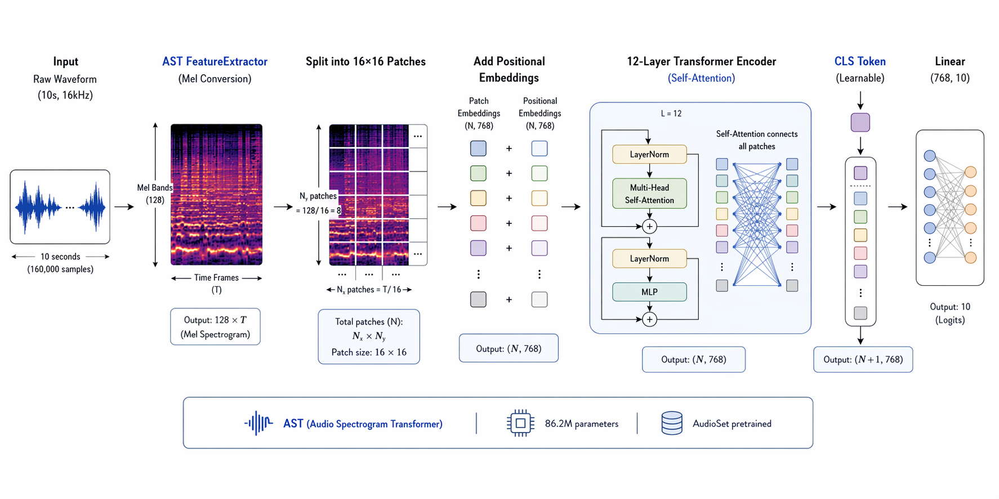
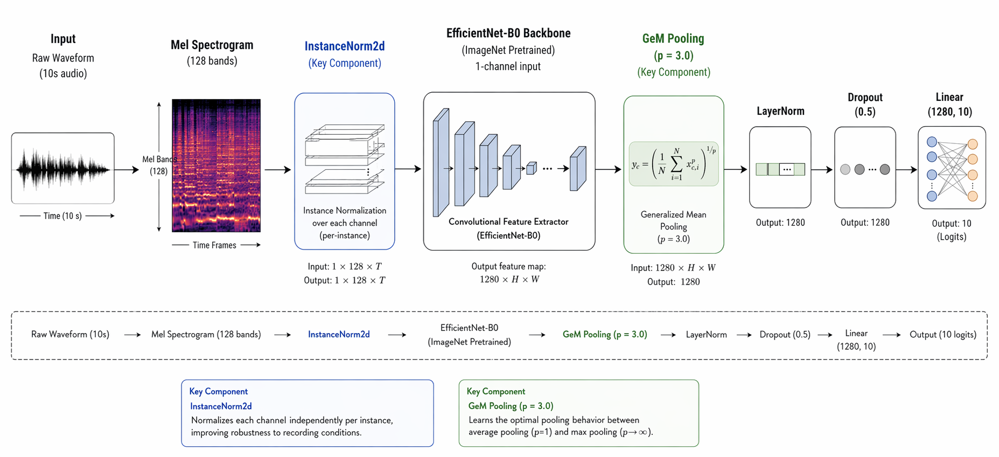
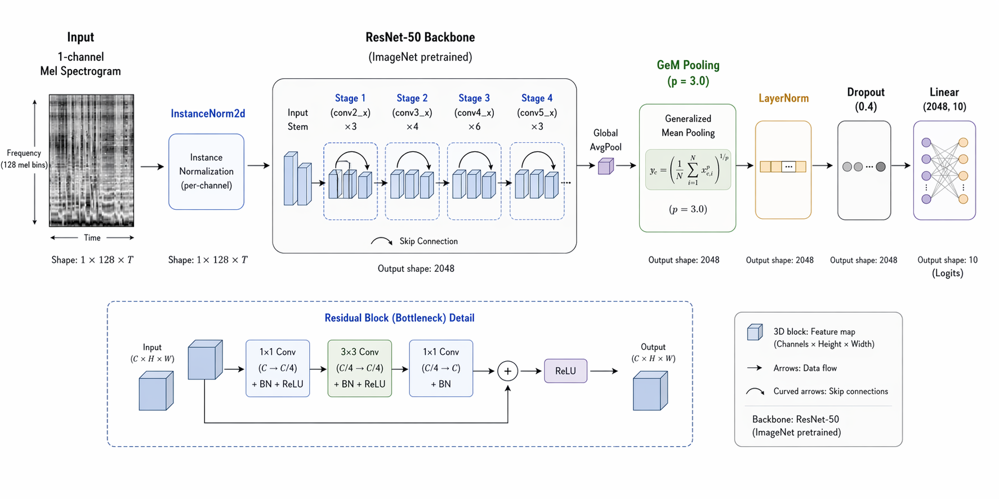
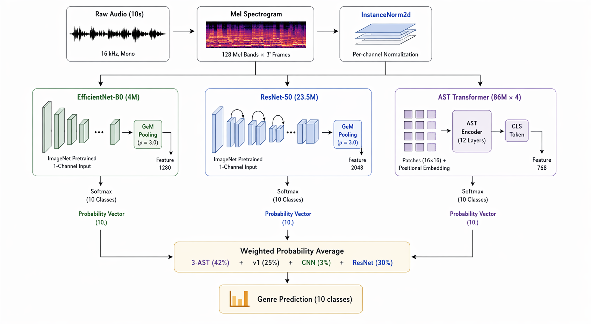

# Messy Mashup - Music Genre Classification

**Predicting Music Genre from Noisy Mashups**

Part of the **Jan 2026 Deep Learning & Generative AI (DLGenAI) Project** at IIT Madras.

🔗 **Live Demo:** [HuggingFace Space](https://huggingface.co/spaces/aloktripathi/music-genre-classifier)
📊 **Kaggle Score:** 0.9614 Macro F1

---

## Task

Given a noisy audio mashup, predict one of 10 genres:
```
blues, classical, country, disco, hiphop, jazz, metal, pop, reggae, rock
```
Evaluation metric: **Macro F1 Score**

---

## The Challenge

Training data consists of **clean separated stems** (drums, vocals, bass), but test data contains **noisy mashups** where stems are mixed together with tempo changes and environmental noise. A model trained directly on clean stems fails on noisy mashups. The entire solution design revolves around **bridging this domain gap**.

---

## Dataset

| Component | Description |
|-----------|-------------|
| `genres_stems/` | 10 genres × 100 songs × 3 stems (drums, vocals, bass) — `others` stem missing |
| `ESC-50-master/` | 2000 environmental noise clips (50 categories) for augmentation |
| `mashups/` | 3020 unlabeled test mashups (stems mixed + tempo adjusted + noise) |

---

## Results

| Experiment | Model | Val F1 | LB Score |
|-----------|-------|--------|----------|
| EXP_001 | Scratch CNN (no pretraining) | 0.75 | 0.5293 |
| EXP_002 | EfficientNet-B0 (ImageNet pretrained) | 0.82 | 0.8504 |
| EXP_003 | AST v1 (AudioSet pretrained) | 0.88 | 0.9279 |
| EXP_003 | AST v2 (stronger aug — worse) | 0.88 | 0.8973 |
| EXP_004 | ResNet-50 (on-the-fly) | 0.86 | ~0.86 |
| — | CNN + AST (20/80) | — | 0.9349 |
| — | CNN + AST + ResNet (10/60/30) | — | 0.9504 |
| — | **3-AST + v1 + CNN + ResNet** | — | **0.9614** |


---

## Model Architectures

### 1. Scratch CNN (Baseline)
4 conv blocks (32→64→128→256), BatchNorm, ReLU, MaxPool, AdaptiveAvgPool, Dropout, Linear. **0.42M params**, no pretrained weights.



### 2. EfficientNet-B0
Mel Spectrogram → **InstanceNorm** → EfficientNet-B0 (ImageNet) → **GeM Pooling** (p=3.0) → Dropout(0.5) → Linear(10). **4M params**.



### 3. Audio Spectrogram Transformer (AST)
Waveform → AST FeatureExtractor → **AST-base** (12-layer Transformer, AudioSet pretrained) → Linear(10). **86.2M params**. Uses self-attention to capture global temporal patterns across the full 10s clip.


### 4. ResNet-50
Mel Spectrogram → **InstanceNorm** → ResNet-50 (ImageNet) → **GeM Pooling** (p=3.0) → Dropout(0.4) → Linear(10). **23.5M params**. Skip connections enable deep feature learning.



### 5. Final Ensemble Pipeline



---

## Approach

### EDA Findings
- `others` stem missing for all 1000 songs (undocumented)
- Drums carry most genre signal (ANOVA F=76.8 > vocals 60.1 > bass 18.8)
- Classical/jazz 20× quieter than hiphop → motivated **Instance Normalization**
- Significant train↔test distribution shift → **augmentation quality > architecture choice**

### Data Augmentation (On-the-fly)
- **Cross-song mashup**: drums from song A + vocals from song B + bass from song C (same genre)
- **ESC-50 noise injection**: 0-2 clips at SNR 5-25 dB
- **Overdrive distortion**: torch.clamp at 30% probability
- **Time shift**: torch.roll up to ±1 second
- **SpecAugment**: 2 freq masks (27 bins) + 2 time masks (80 frames)
- **Mixup**: α=0.4, applied 50% of the time

### Key Design Decisions
- **InstanceNorm** over BatchNorm for volume invariance (20× energy difference across genres)
- **GeM Pooling** (p=3.0) over AdaptiveAvgPool to focus on discriminative spectrogram regions
- **Differential LR** for AST: backbone 1e-5, head 1e-3 (preserve AudioSet features)
- **Gradient accumulation** ×4 for AST (effective batch 32 from batch 8)
- **Multi-seed training** (seeds 42/123/777) to reduce prediction variance

### What Didn't Work
- **Pseudo-labeling**: degraded AST from 0.927 → 0.867 (corrupted pretrained features)
- **Stronger augmentation (AST v2)**: scored worse at 0.897 (exceeded test distribution)

---

## Repo Structure

```
music-genre-classification/
├── README.md
├── LICENSE
├── requirements.txt
├── project_report.pdf
├── .gitignore
│
├── notebooks/                # Experiment notebooks
│   ├── 01_eda.ipynb
│   ├── 02_scratch_cnn.ipynb
│   ├── 03_cnn_efficientnet.ipynb
│   ├── 04_ast.ipynb
│   ├── 05_resnet50.ipynb
│   └── 06_multi_seed_ast.ipynb
│
├── src/                      # Modular source code
│   ├── config.py             # Hyperparameters & paths
│   ├── dataset.py            # MashupDataset, ValDataset, TestDataset
│   ├── augmentation.py       # Noise injection, overdrive, mixup, specaugment
│   ├── train.py              # Training loop with mixed precision
│   ├── inference.py          # Model loading & submission generation
│   ├── ensemble.py           # Weight sweep & probability averaging
│   └── models/
│       ├── scratch_cnn.py
│       ├── efficientnet.py
│       ├── ast_model.py
│       ├── resnet50.py
│       └── multi_seed_ast.py
│
├── deployment/               # HuggingFace Spaces
│   ├── app.py                # Streamlit app
│   ├── Dockerfile
│   └── README.md
```

---

## Deployment

Deployed as a **Streamlit** app on HuggingFace Spaces (Docker SDK, CPU inference).

Upload a music clip → 3 models process independently → weighted ensemble predicts genre with confidence scores.

🔗 [https://huggingface.co/spaces/aloktripathi/music-genre-classifier](https://huggingface.co/spaces/aloktripathi/music-genre-classifier)

---

## Setup

```bash
git clone https://github.com/aloktripathi/music-genre-classification.git
cd music-genre-classification
pip install -r requirements.txt
```

---

## Tools & Infrastructure

- **Frameworks**: PyTorch, torchaudio, timm, HuggingFace Transformers
- **Audio**: librosa, scikit-learn
- **Tracking**: Weights & Biases
- **Deployment**: Streamlit + Docker on HuggingFace Spaces
- **Training**: Lightning.ai (L4 GPU) and Kaggle (T4 GPU)

---

## References

- [AST: Audio Spectrogram Transformer](https://arxiv.org/abs/2104.01778) — Gong et al., 2021
- [EfficientNet](https://arxiv.org/abs/1905.11946) — Tan & Le, 2019
- [Deep Residual Learning (ResNet)](https://arxiv.org/abs/1512.03385) — He et al., 2016
- [SpecAugment](https://arxiv.org/abs/1904.08779) — Park et al., 2019
- [mixup](https://arxiv.org/abs/1710.09412) — Zhang et al., 2018
- [ESC-50](https://github.com/karolpiczak/ESC-50) — Piczak, 2015
- [librosa](https://librosa.org) — McFee et al., 2015